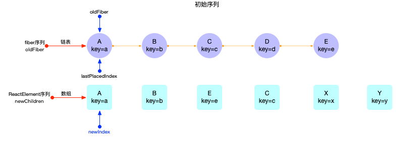
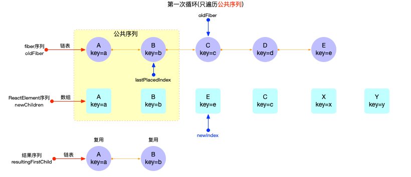
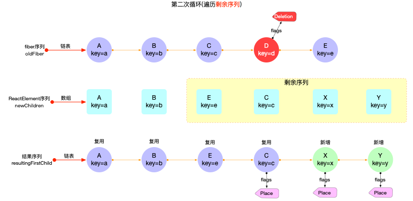

---
nav:
  title: 高频算法
  order: 1
title: 调和算法
order: 0
---

# React 算法之调和算法

## 概念

调和函数([源码](https://github.com/facebook/react/blob/v17.0.2/packages/react-reconciler/src/ReactChildFiber.old.js#L1274-L1410))是在`fiber树构(对比更新)`过程中对`旧fiber节点`与`新reactElement`进行比较, 判定`旧fiber节点`是否可以复用的一个比较函数.

调和函数仅是`fiber树构造`过程中的一个环节, 所以在深入理解这个函数之前, 建议对`fiber树构造`有一个宏观的理解(可以参考前文[fiber 树构造(初次创建)](../main/fibertree-create.md), [fiber 树构造(对比更新)](../main/fibertree-update.md)), 本节重点探讨其算法的实现细节.

它的主要作用:

1. 给新增,移动,和删除节点设置`fiber.flags`(新增, 移动: `Placement`, 删除: `Deletion`)
2. 如果是需要删除的`fiber`, [除了自身打上`Deletion`之外, 还要将其添加到父节点的`effects`链表中](https://github.com/facebook/react/blob/v17.0.2/packages/react-reconciler/src/ReactChildFiber.old.js#L275-L294)(正常副作用队列的处理是在`completeWork`函数, 但是该节点(被删除)会脱离`fiber`树, 不会再进入`completeWork`阶段, 所以在`beginWork`阶段提前加入副作用队列).

## 特性

算法复杂度低, 从上至下比较整个树形结构, 时间复杂度被缩短到 O(n)

## 基本原理

1. 比较对象: `fiber`对象与`ReactElement`对象相比较.
   - 注意: 此处有一个误区, 并不是两棵 fiber 树相比较, 而是`旧fiber`对象与`新ReactElement`对象向比较, 结果生成新的`fiber子节点`.
   - 可以理解为输入`ReactElement`, 经过`reconcileChildren()`之后, 输出`fiber`.
2. 比较方案:
   - 单节点比较
   - 可迭代节点比较

### 单节点比较

单节点的逻辑比较简明, 先直接看[源码](https://github.com/facebook/react/blob/v17.0.2/packages/react-reconciler/src/ReactChildFiber.old.js#L1135-L1233):

```js
// 只保留主干逻辑
function reconcileSingleElement(
  returnFiber: Fiber,
  currentFirstChild: Fiber | null,
  element: ReactElement,
  lanes: Lanes,
): Fiber {
  const key = element.key;
  let child = currentFirstChild;

  while (child !== null) {
    // currentFirstChild !== null, 表明是对比更新阶段
    if (child.key === key) {
      // 1. key相同, 进一步判断 child.elementType === element.type
      switch (child.tag) {
        // 只看核心逻辑
        default: {
          if (child.elementType === element.type) {
            // 1.1 已经匹配上了, 如果有兄弟节点, 需要给兄弟节点打上Deletion标记
            deleteRemainingChildren(returnFiber, child.sibling);
            // 1.2 构造fiber节点, 新的fiber对象会复用current.stateNode, 即可复用DOM对象
            const existing = useFiber(child, element.props);
            existing.ref = coerceRef(returnFiber, child, element);
            existing.return = returnFiber;
            return existing;
          }
          break;
        }
      }
      // Didn't match. 给当前节点点打上Deletion标记
      deleteRemainingChildren(returnFiber, child);
      break;
    } else {
      // 2. key不相同, 匹配失败, 给当前节点打上Deletion标记
      deleteChild(returnFiber, child);
    }
    child = child.sibling;
  }

  {
    // ...省略部分代码, 只看核心逻辑
  }

  // 新建节点
  const created = createFiberFromElement(element, returnFiber.mode, lanes);
  created.ref = coerceRef(returnFiber, currentFirstChild, element);
  created.return = returnFiber;
  return created;
}
```

1. 如果是新增节点, 直接新建 fiber, 没有多余的逻辑
2. 如果是对比更新
   - 如果`key`和`type`都相同(即: `ReactElement.key` === `Fiber.key` 且 `Fiber.elementType === ReactElement.type`), 则复用
   - 否则新建

注意: 复用过程是调用`useFiber(child, element.props)`创建`新的fiber`对象, 这个`新fiber对象.stateNode = currentFirstChild.stateNode`, 即`stateNode`属性得到了复用, 故 DOM 节点得到了复用.

### 可迭代节点比较(数组类型, [Symbol.iterator]=fn,[@@iterator]=fn)

可迭代节点比较, 在[源码中](https://github.com/facebook/react/blob/v17.0.2/packages/react-reconciler/src/ReactChildFiber.old.js#L1346-L1362)被分为了 2 个部分:

```js
function reconcileChildFibers(
  returnFiber: Fiber,
  currentFirstChild: Fiber | null,
  newChild: any,
  lanes: Lanes,
): Fiber | null {
  if (isArray(newChild)) {
    return reconcileChildrenArray(
      returnFiber,
      currentFirstChild,
      newChild,
      lanes,
    );
  }
  if (getIteratorFn(newChild)) {
    return reconcileChildrenIterator(
      returnFiber,
      currentFirstChild,
      newChild,
      lanes,
    );
  }
}
```

其中`reconcileChildrenArray函数`(针对数组类型)和`reconcileChildrenIterator`(针对可迭代类型)的核心逻辑几乎一致, 下文将分析[`reconcileChildrenArray()`函数](https://github.com/facebook/react/blob/v17.0.2/packages/react-reconciler/src/ReactChildFiber.old.js#L771-L924). 如果是新增节点, 所有的比较逻辑都无法命中, 只有`对比更新`过程, 才有实际作用, 所以下文重点分析`对比更新`的情况.

```js
function reconcileChildrenArray(
  returnFiber: Fiber,
  currentFirstChild: Fiber | null,
  newChildren: Array<*>,
  lanes: Lanes,
): Fiber | null {
  let resultingFirstChild: Fiber | null = null;
  let previousNewFiber: Fiber | null = null;

  let oldFiber = currentFirstChild;
  let lastPlacedIndex = 0;
  let newIdx = 0;
  let nextOldFiber = null;
  // 1. 第一次循环: 遍历最长公共序列(key相同), 公共序列的节点都视为可复用
  for (; oldFiber !== null && newIdx < newChildren.length; newIdx++) {
    // 后文分析
  }

  if (newIdx === newChildren.length) {
    // 如果newChildren序列被遍历完, 那么oldFiber序列中剩余节点都视为删除(打上Deletion标记)
    deleteRemainingChildren(returnFiber, oldFiber);
    return resultingFirstChild;
  }

  if (oldFiber === null) {
    // 如果oldFiber序列被遍历完, 那么newChildren序列中剩余节点都视为新增(打上Placement标记)
    for (; newIdx < newChildren.length; newIdx++) {
      // 后文分析
    }
    return resultingFirstChild;
  }

  // ==================分割线==================
  const existingChildren = mapRemainingChildren(returnFiber, oldFiber);

  // 2. 第二次循环: 遍历剩余非公共序列, 优先复用oldFiber序列中的节点
  for (; newIdx < newChildren.length; newIdx++) {}

  if (shouldTrackSideEffects) {
    // newChildren已经遍历完, 那么oldFiber序列中剩余节点都视为删除(打上Deletion标记)
    existingChildren.forEach((child) => deleteChild(returnFiber, child));
  }

  return resultingFirstChild;
}
```

`reconcileChildrenArray`函数源码看似很长, 梳理其主干之后, 其实非常清晰.

通过形参, 首先明确比较对象是`currentFirstChild: Fiber | null`和`newChildren: Array<*>`:

- `currentFirstChild`: 是一个`fiber`节点, 通过`fiber.sibling`可以将兄弟节点全部遍历出来. 所以可以将`currentFirstChild`理解为链表头部, 它代表一个序列, 源码中被记为`oldFiber`.
- `newChildren`: 是一个数组, 其中包含了若干个`ReactElement`对象. 所以`newChildren`也代表一个序列.

所以`reconcileChildrenArray`实际就是 2 个序列之间的比较(`链表oldFiber`和`数组newChildren`), 最后返回合理的`fiber`序列.

上述代码中, 以注释分割线为界限, 整个核心逻辑分为 2 步骤:

1. 第一次循环: 遍历最长`公共`序列(key 相同), 公共序列的节点都视为可复用
   - 如果`newChildren序列`被遍历完, 那么`oldFiber序列`中剩余节点都视为删除(打上`Deletion`标记)
   - 如果`oldFiber序列`被遍历完, 那么`newChildren序列`中剩余节点都视为新增(打上`Placement`标记)
2. 第二次循环: 遍历剩余`非公共`序列, 优先复用 oldFiber 序列中的节点
   - 在对比更新阶段(非初次创建`fiber`, 此时`shouldTrackSideEffects`被设置为 true). 第二次循环遍历完成之后, `oldFiber序列中`没有匹配上的节点都视为删除(打上`Deletion`标记)

假设有如下图所示 2 个初始化序列:



接下来第一次循环, 会遍历公共序列`A,B`, 生成的 fiber 节点`fiber(A), fiber(B)`可以复用.



最后第二次循环, 会遍历剩余序列`E,C,X,Y`:

- 生成的 fiber 节点`fiber(E), fiber(C)`可以复用. 其中`fiber(C)`节点发生了位移(打上`Placement`标记).
- `fiber(X), fiber(Y)`是新增(打上`Placement`标记).
- 同时`oldFiber`序列中的`fiber(D)`节点确定被删除(打上`Deletion`标记).



整个主干逻辑就介绍完了, 接下来贴上完整源码

> 第一次循环

```js
// 1. 第一次循环: 遍历最长公共序列(key相同), 公共序列的节点都视为可复用
for (; oldFiber !== null && newIdx < newChildren.length; newIdx++) {
  if (oldFiber.index > newIdx) {
    nextOldFiber = oldFiber;
    oldFiber = null;
  } else {
    nextOldFiber = oldFiber.sibling;
  }
  // new槽位和old槽位进行比较, 如果key不同, 返回null
  // key相同, 比较type是否一致. type一致则执行useFiber(update逻辑), type不一致则运行createXXX(insert逻辑)
  const newFiber = updateSlot(
    returnFiber,
    oldFiber,
    newChildren[newIdx],
    lanes,
  );

  if (newFiber === null) {
    // 如果返回null, 表明key不同. 无法满足公共序列条件, 退出循环
    if (oldFiber === null) {
      oldFiber = nextOldFiber;
    }
    break;
  }
  if (shouldTrackSideEffects) {
    // 若是新增节点, 则给老节点打上Deletion标记
    if (oldFiber && newFiber.alternate === null) {
      deleteChild(returnFiber, oldFiber);
    }
  }

  // lastPlacedIndex 记录被移动的节点索引
  // 如果当前节点可复用, 则要判断位置是否移动.
  lastPlacedIndex = placeChild(newFiber, lastPlacedIndex, newIdx);

  // 更新resultingFirstChild结果序列
  if (previousNewFiber === null) {
    resultingFirstChild = newFiber;
  } else {
    previousNewFiber.sibling = newFiber;
  }
  previousNewFiber = newFiber;
  oldFiber = nextOldFiber;
}
```

> 第二次循环

```js
// 1. 将第一次循环后, oldFiber剩余序列加入到一个map中. 目的是为了第二次循环能顺利的找到可复用节点
const existingChildren = mapRemainingChildren(returnFiber, oldFiber);

// 2. 第二次循环: 遍历剩余非公共序列, 优先复用oldFiber序列中的节点
for (; newIdx < newChildren.length; newIdx++) {
  const newFiber = updateFromMap(
    existingChildren,
    returnFiber,
    newIdx,
    newChildren[newIdx],
    lanes,
  );
  if (newFiber !== null) {
    if (shouldTrackSideEffects) {
      if (newFiber.alternate !== null) {
        // 如果newFiber是通过复用创建的, 则清理map中对应的老节点
        existingChildren.delete(newFiber.key === null ? newIdx : newFiber.key);
      }
    }
    lastPlacedIndex = placeChild(newFiber, lastPlacedIndex, newIdx);
    // 更新resultingFirstChild结果序列
    if (previousNewFiber === null) {
      resultingFirstChild = newFiber;
    } else {
      previousNewFiber.sibling = newFiber;
    }
    previousNewFiber = newFiber;
  }
}
// 3. 善后工作, 第二次循环完成之后, existingChildren中剩余的fiber节点就是将要被删除的节点, 打上Deletion标记
if (shouldTrackSideEffects) {
  existingChildren.forEach((child) => deleteChild(returnFiber, child));
}
```

### 结果

无论是单节点还是可迭代节点的比较, 最终的目的都是生成下级子节点. 并在`reconcileChildren`过程中, 给一些有副作用的节点(新增, 删除, 移动位置等)打上副作用标记, 等待 commit 阶段(参考fiber 树渲染)的处理.

## 总结

本节介绍了 React 源码中, `fiber构造循环`阶段用于生成下级子节点的`reconcileChildren`函数(函数中的算法被称为调和算法), 并演示了`可迭代节点比较`的图解示例. 该算法十分巧妙, 其核心逻辑把`newChildren序列`分为 2 步遍历, 先遍历公共序列, 再遍历非公共部分, 同时复用`oldFiber`序列中的节点.
